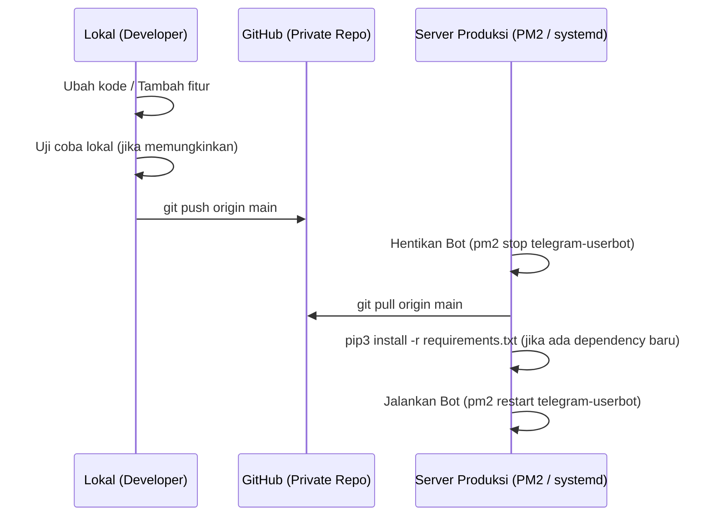

# Alur Kerja Git & GitHub (Git Workflow)

Dokumen ini menjelaskan alur kerja pengembangan (development workflow) dari lokal komputer Anda ke repositori GitHub hingga penyebaran (deploy) kode terbaru ke server produksi.

---

## Alur Pengembangan & Deploy



---

## Panduan Langkah-demi-Langkah

### Langkah 1: Inisialisasi Repositori Git (Pertama Kali)

Buka terminal di direktori proyek lokal Anda dan jalankan perintah berikut:
```bash
# Masuk ke direktori proyek
cd telethon/

# Inisialisasi git
git init

# Tambahkan berkas
git add .

# Buat commit pertama
git commit -m "Initial commit: Userbot Promo Framework"

# Hubungkan ke repositori GitHub Private Anda
git remote add origin https://github.com/username/nama-repo-anda.git

# Push ke GitHub
git push -u origin main
```

> [!WARNING]
> Sebelum melakukan `git add .`, pastikan file `.gitignore` sudah ada di direktori tersebut. Jangan pernah mem-push file `.env` atau folder `sessions/` ke repositori Anda.

---

### Langkah 2: Melakukan Pembaruan Kode Lokal

Saat Anda ingin memperbaiki bug atau menambahkan fitur baru:
1. Lakukan perubahan pada kode di komputer lokal Anda.
2. Commit perubahan Anda:
   ```bash
   git add .
   git commit -m "Deskripsi perubahan: misalnya menambahkan web panel"
   ```
3. Kirim perubahan ke GitHub:
   ```bash
   git push origin main
   ```

---

### Langkah 3: Menarik Kode Terbaru di Server Produksi

Untuk memperbarui bot yang sedang berjalan di server:
1. Masuk ke terminal/SSH server produksi Anda.
2. Matikan bot terlebih dahulu:
   ```bash
   pm2 stop telegram-userbot
   ```
3. Jalankan git pull untuk menarik kode terbaru dari GitHub:
   ```bash
   git pull origin main
   ```
4. Jika ada library baru yang ditambahkan ke `requirements.txt`, instal kembali dependensinya:
   ```bash
   pip3 install -r requirements.txt
   ```
5. Jalankan kembali bot:
   ```bash
   pm2 start telegram-userbot
   ```
6. Selesai! Bot Anda kini berjalan menggunakan kode terbaru tanpa kehilangan file sesi atau database SQLite Anda.
