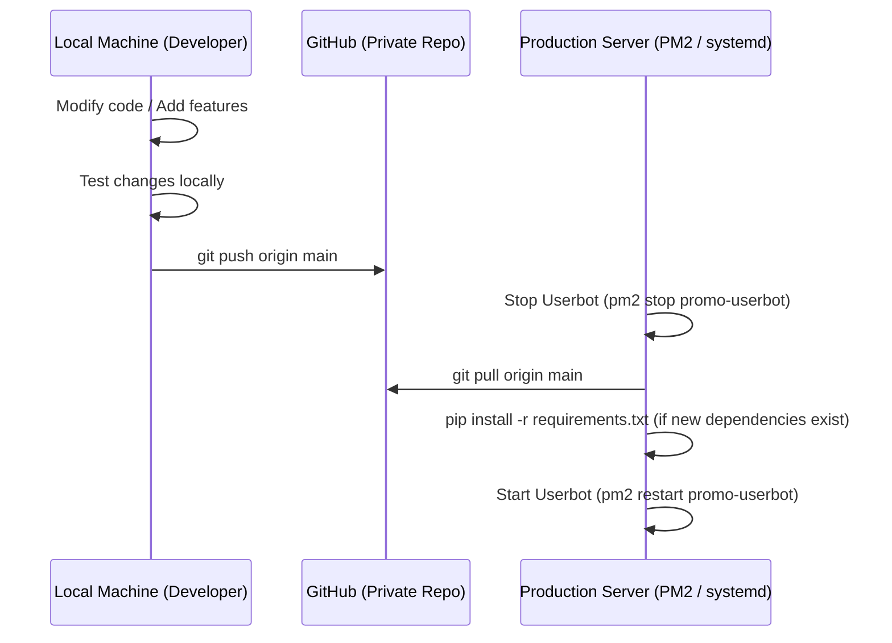

# Git & GitHub Workflow

This document explains the development workflow for pushing code changes from your local development machine to GitHub, and subsequently pulling updates onto your production server.

---

## Development & Deployment Flow



---

## Step-by-Step Guide

### Step 1: Initialize Git Repository (One-Time Setup)

Open a terminal in your local project folder and execute the following commands to link it to your remote repository:
```bash
# Navigate to the project root
cd telethon/

# Initialize Git tracking
git init

# Add all files to stage
git add .

# Create the initial commit
git commit -m "Initial commit: Userbot Promo Framework"

# Link to your remote GitHub repository
git remote add origin https://github.com/username/your-repository-name.git

# Push to the main branch
git push -u origin main
```

> [!WARNING]
> Ensure that your `.gitignore` file is fully configured before running `git add .`. Never push `.env` files or the `sessions/` directory containing sensitive Telegram credentials to public or untracked remote locations.

---

### Step 2: Developing and Pushing Code Updates

When fixing a bug or introducing new features:
1. Implement your code changes locally.
2. Commit your modifications:
   ```bash
   git add .
   git commit -m "feat: implement web control panel layout adjustments"
   ```
3. Push changes to GitHub:
   ```bash
   git push origin main
   ```

---

### Step 3: Fetching and Deploying Updates on the Production Server

To update the running userbot on your VPS:
1. Log in to your production server via SSH.
2. Stop the running userbot process:
   ```bash
   pm2 stop promo-userbot
   ```
3. Pull the latest commits from GitHub:
   ```bash
   git pull origin main
   ```
4. If new dependencies were added to `requirements.txt`, install them in your virtual environment:
   ```bash
   pip install -r requirements.txt
   ```
5. Restart the daemon process:
   ```bash
   pm2 start promo-userbot
   ```
6. The userbot will resume execution using the updated codebase without disrupting your active SQLite databases or Telegram session binaries.
