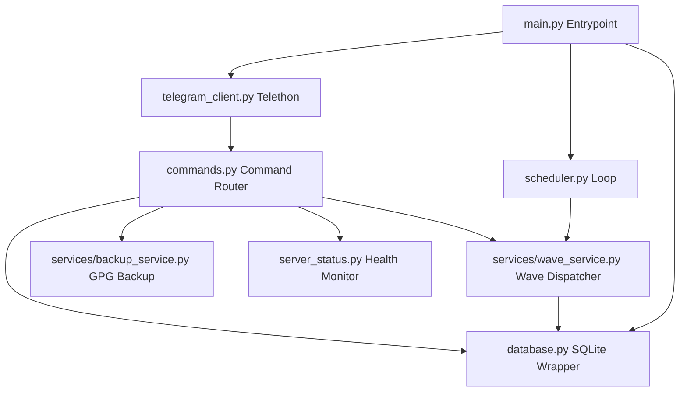

# System Architecture Documentation

This document explains the system architecture, module interactions, database design, and runtime state management implemented in the Python Telegram Userbot Promo Framework.

---

## 1. Architectural Overview

The project uses a modular, event-driven architecture built on asynchronous programming (`asyncio`). This design ensures that the bot can monitor Telegram messages and respond to commands in real-time while simultaneously executing background scheduler cycles without blocking the main event thread.

### Module Interactions



---

## 2. Module Specifications

### A. Core Entrypoint (`main.py`)
Responsible for bootstrapping the application:
1. Initializes the SQLite database schema and executes required migrations.
2. Loads persisted settings (`paused`, `min_delay`, `max_delay`) from SQLite into the in-memory global state.
3. Establishes the MTProto Telethon connection with Telegram.
4. Registers command event listeners on the Telegram client.
5. Spawns the asynchronous background scheduler loop.
6. Attaches termination signal listeners (`SIGINT`, `SIGTERM` on supported platforms) to run a graceful shutdown sequence (closing database files, stopping Uvicorn, disconnecting clients).

### B. Configuration System (`config.py`)
Loads environment variables from `.env`, casts data types (such as parsing delays to integers and options to booleans), sets secure fallback defaults, and validates mandatory fields like `API_ID` & `API_HASH` before startup.

### C. Database Wrapper (`database.py`)
Implements an asynchronous interface for the SQLite database. Since the default Python `sqlite3` module is synchronous and blocking, all queries are wrapped in `asyncio.to_thread` to run in worker threads. This prevents blocking the main `asyncio` event loop.

### D. Background Scheduler (`scheduler.py`)
A continuous task loop that computes randomized intervals (in minutes) between the minimum and maximum boundaries. The scheduler uses a responsive sleeping interval (checks every 5 seconds) so that pause or resume commands take effect immediately without waiting for a long sleep cycle to end.

### E. Promotional Wave Service (`services/wave_service.py`)
Coordinates sending promotional messages sequentially across active targets:
- **Anti Double-Wave Lock**: Uses `state.active_wave_task` as a global runtime lock to prevent manual and automatic waves from running at the same time.
- **Inter-Group Delay**: Pauses between message dispatches to prevent rate-limiting or anti-spam triggers.
- **FloodWait Handler**: Captures Telegram rate-limit exceptions and automatically pauses sending if the cooldown duration is manageable, or skips the group if it requires a long wait.

### F. GPG Backup Service (`services/backup_service.py`)
Bundles source code files, database instances, and active session keys into a ZIP package. If `gpg` is available on the system, the archive is encrypted using AES-256 symmetric encryption before transmitting it to the Telegram target and deleting temporary files from the disk.

---

## 3. SQLite Database Schema

The database tracks configurations, target group directories, and execution histories:

```
+--------------------------------------------------------+
|                      database.db                       |
+--------------------------------------------------------+
|  1. settings: key (PK), value, updated_at              |
|  2. groups: id (PK), username, title, raw_input,       |
|            is_skipped, status, last_send_status,       |
|            last_error, last_checked_at, last_success_at|
|            fail_streak, auto_skip_reason,              |
|            cooldown_until, created_at, updated_at      |
|  3. templates: id (PK), text, is_active,               |
|               created_at, updated_at                   |
|  4. wave_logs: id (PK), started_at, finished_at,        |
|               status, success_count, fail_count        |
|  5. wave_log_items: id (PK), wave_log_id (FK),          |
|                    group_id, group_title, status,      |
|                    error_message, message_id           |
|  6. command_logs: id (PK), sender_id, sender_username, |
|                  text, status, created_at              |
+--------------------------------------------------------+
```

---

## 4. Runtime State Management

The application maintains a singleton `state` object (`utils.py`) to share operational variables across different asynchronous tasks:
- `is_paused`: Pauses or resumes background scheduler loops.
- `active_wave_task`: Holds a reference to the active `asyncio.Task` wave.
- `next_run_time`: The timestamp for the next scheduled automated wave.
- `last_run_time`: The timestamp when the last wave execution finished.
- `min_delay` / `max_delay`: Active randomized delay boundaries.
