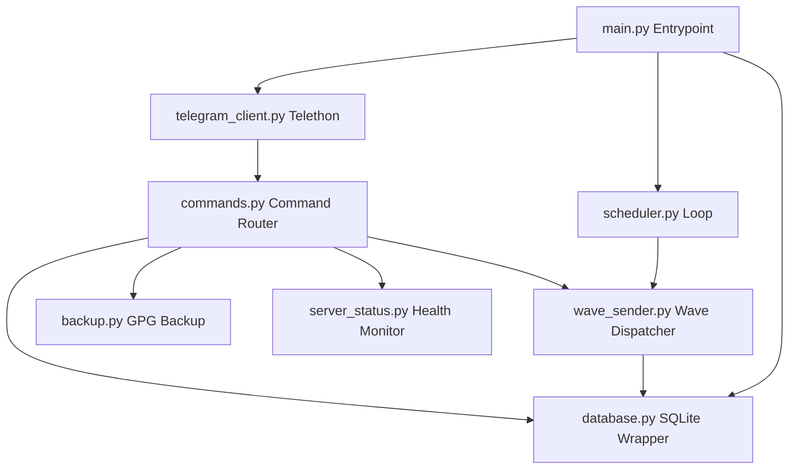

# Dokumentasi Arsitektur Sistem

Dokumen ini menjelaskan struktur arsitektur, interaksi modul, desain database, dan manajemen state yang diimplementasikan pada Python Telegram Userbot Promo Framework.

---

## 1. Ikhtisar Arsitektur

Project ini menggunakan arsitektur modular yang didorong oleh event (event-driven) berbasis pemrograman asinkron (`asyncio`). Ini memastikan bot dapat memantau pesan Telegram secara real-time sekaligus menjalankan penjadwal (scheduler) background tanpa saling memblokir satu sama lain.

### Hubungan Antar Komponen



---

## 2. Rincian Modul

### A. Core & Entrypoint (`main.py`)
Bertanggung jawab atas bootstrapping aplikasi:
1. Inisialisasi koneksi database SQLite dan migrasi tabel.
2. Memuat pengaturan dinamis dari database (`paused`, `min_delay`, `max_delay`) ke dalam *Global State* di memori.
3. Mengaktifkan koneksi MTProto Telethon ke Telegram.
4. Mendaftarkan command handler ke client Telegram.
5. Menjalankan task asinkron scheduler di latar belakang.
6. Menangani sinyal terminasi sistem (`SIGINT`, `SIGTERM`) secara anggun (graceful shutdown).

### B. Konfigurasi (`config.py`)
Membaca environment variables dari file `.env`, melakukan konversi tipe data (misal: casting delay string ke integer, parsing boolean), memberikan default fallback yang aman, dan memvalidasi kredensial wajib (seperti `API_ID` & `API_HASH`).

### C. Database Wrapper (`database.py`)
Menyediakan layer abstraksi untuk database SQLite. Karena module `sqlite3` Python bersifat sinkron (blocking), semua operasi query dibungkus dengan `asyncio.to_thread` agar berjalan di thread terpisah. Hal ini menjaga agar loop utama `asyncio` tetap responsif saat bot membaca/menulis data.

### D. Penjadwal Background (`scheduler.py`)
Task background mandiri yang menghitung delay acak dalam menit antara batas minimum dan maksimum. Scheduler mengimplementasikan tidur asinkron responsif (responsive sleep) dalam interval 5 detik. Hal ini memungkinkan bot langsung merespons ketika admin mengubah status bot dari *Running* ke *Paused* atau sebaliknya, tanpa harus menunggu tidur panjang selesai.

### E. Pengirim Wave (`wave_sender.py`)
Berisi logika utama pengiriman pesan promosi secara berurutan. Dilengkapi dengan:
- **Anti Double-Wave Lock**: Memastikan tidak ada dua wave (otomatis vs manual) yang berjalan bersamaan dengan memeriksa `state.active_wave_task`.
- **Delay Antar Grup**: Mencegah akun terdeteksi sebagai spammer dengan memberikan delay jeda aman.
- **Penanganan FloodWait**: Jika mendeteksi rate limit dari Telegram, bot akan tidur sementara (jika durasi < 90 detik) lalu mencoba mengirim ulang, atau melewatkan grup tersebut jika durasi terlalu lama.

### F. Backup Engine (`backup.py`)
Mengemas file penting, basis data, dan berkas sesi ke dalam format `.zip`. Jika perintah `gpg` tersedia di server, berkas zip dienkripsi menggunakan metode enkripsi simetris **AES256** menggunakan password rahasia, lalu menghapus zip mentah dari server.

---

## 3. Desain Database (SQLite)

Tabel dirancang secara sederhana namun lengkap untuk melacak status operasional bot:

```
+--------------------------------------------------------+
|                      database.db                       |
+--------------------------------------------------------+
|  1. settings: key (PK), value, updated_at              |
|  2. groups: id (PK), username, title, raw_input,       |
|            is_skipped, created_at, updated_at          |
|  3. templates: id (PK), text, is_active,               |
|               created_at, updated_at                   |
|  4. wave_logs: id (PK), started_at, finished_at,        |
|               status, success_count, fail_count        |
|  5. wave_log_items: id (PK), wave_log_id (FK),          |
|                    group_id, group_title, status,      |
|                    error_message, message_id           |
|  6. command_logs: id (PK), sender_id, sender_username, |
|                  text, status, created_at              |
+--------------------------------------------------------+
```

---

## 4. Manajemen State

Aplikasi mempertahankan satu objek singleton `state` (di dalam `utils.py`) untuk mempermudah berbagi data runtime antar modul:
- `is_paused`: Menentukan apakah scheduler aktif.
- `active_wave_task`: Referensi ke `asyncio.Task` wave yang sedang berjalan.
- `next_run_time`: Tanggal & waktu wave berikutnya dijadwalkan.
- `last_run_time`: Tanggal & waktu wave terakhir selesai dijalankan.
- `min_delay` / `max_delay`: Rentang batas waktu acak yang aktif.
